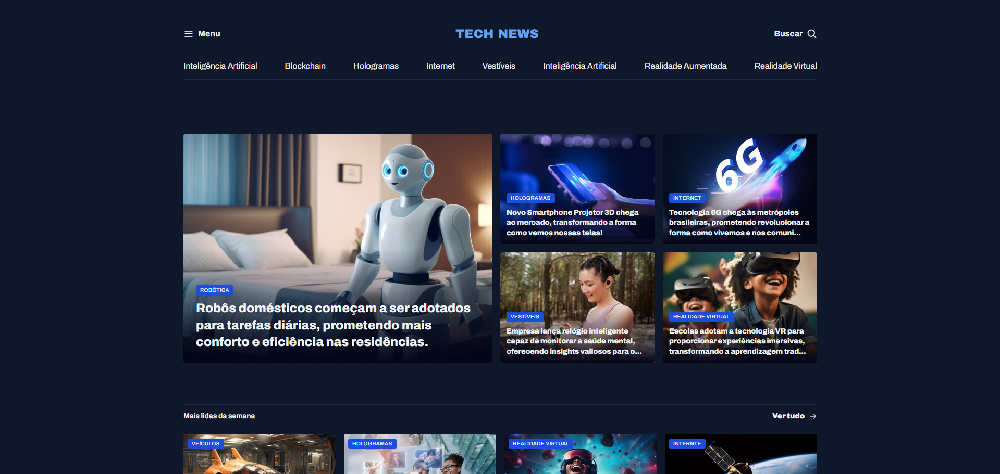

# 📰 Portal Tech

**Portal de notícias de tecnologia** desenvolvido com foco no aprendizado avançado de **CSS Grid**. O projeto simula uma página de portal moderno, com seções para matérias em destaque, mais lidas da semana, destaques de Inteligência Artificial e recomendações — tudo organizado em um layout complexo e totalmente responsivo.

## 📸 Preview

 

## 🚀 Demonstração

🔗 [Acesse o site](https://rochacode08.github.io/Tech-news/)

## 🛠️ Tecnologias utilizadas

- **HTML5** — estruturação semântica com `<header>`, `<main>`, `<section>`, `<article>`, `<aside>`, `<figure>`
- **CSS3** — estilização com foco em **CSS Grid**, variáveis CSS e CSS nesting
- **Google Fonts** — tipografia com a fonte *Archivo*

## ✨ Funcionalidades e destaques do projeto

- ✅ Layout complexo construído inteiramente com **CSS Grid** e `grid-template-areas`
- ✅ Design **totalmente responsivo** com 4 breakpoints (1024px, 768px, 640px e 375px)
- ✅ Menu secundário com **scroll horizontal** no mobile (e scrollbar escondida)
- ✅ Seção de destaques com efeito de **gradiente sobreposto** às imagens
- ✅ Arquitetura CSS **modular** e bem organizada
- ✅ Classes utilitárias **utility-first** (inspirado no Tailwind)
- ✅ Uso de **CSS Custom Properties** (variáveis) para temas e tipografia
- ✅ Uso de **CSS Nesting** nativo (selectors aninhados)

## 🎨 Paleta de cores

Tema dark minimalista com destaque em azul:

| Cor                    | Hex       |
| ---------------------- | --------- |
| 🌑 Background          | `#0F172A` |
| 🪞 Stroke              | `#1E293B` |
| 🔷 Brand Light         | `#60A5FA` |
| 🔵 Brand Dark          | `#1D4ED8` |
| ⚪ Texto Primário       | `#F1F5F9` |
| 🔘 Texto Secundário    | `#CBD5E1` |

## 📂 Estrutura do projeto

```
📦 portal-tech
 ┣ 📂 assets
 ┃ ┣ 📂 icons          → Ícones SVG (menu, lupa, seta)
 ┃ ┣ 📂 images         → Imagens das matérias
 ┃ ┣ 🖼️ Logo.svg
 ┃ ┗ 🖼️ Ads.png
 ┣ 📂 styles
 ┃ ┣ 📜 index.css      → Arquivo principal que importa os demais
 ┃ ┣ 📜 global.css     → Reset, variáveis e estilos globais
 ┃ ┣ 📜 utilities.css   → Classes utilitárias (grid, gap, tamanhos de texto)
 ┃ ┣ 📜 header.css     → Estilos do cabeçalho e navegação
 ┃ ┗ 📜 sections.css   → Estilos das seções do portal
 ┗ 📜 index.html        → Página principal
```

## 📱 Responsividade

O projeto conta com **4 breakpoints** cuidadosamente pensados:

| Dispositivo    | Largura máxima | Ajustes principais                          |
| -------------- | -------------- | ------------------------------------------- |
| 💻 Desktop     | acima de 1024px | Layout em grid de 2 colunas                 |
| 💻 Tablet      | até 1024px      | Grid em coluna única                        |
| 📱 Mobile      | até 768px       | Menu secundário com scroll horizontal       |
| 📱 Mobile S    | até 640px       | Reorganização completa dos cards            |
| 📱 Mobile XS   | até 375px       | Redução das fontes via variáveis CSS        |

## 💻 Como rodar o projeto

Clone o repositório:

```bash
git clone https://github.com/rochacode08/Tech-news.git
```

Acesse a pasta do projeto:

```bash
cd Tech-news
```

Abra o arquivo `index.html` no navegador — ou utilize a extensão **Live Server** do VS Code para recarregamento automático.

## 📚 O que eu aprendi

Este projeto foi um grande salto na minha evolução com CSS. Consegui colocar em prática conceitos bem avançados:

- **CSS Grid** completo: `grid-template-areas`, `grid-template-columns`, `grid-template-rows`
- Propriedades: `grid-auto-flow`, `gap`, `row-gap`, `column-gap`, `justify-self`, `place-items`
- **CSS Custom Properties** (variáveis) para criar um *design system* consistente
- **CSS Nesting** nativo (selectors aninhados sem precisar de pré-processador)
- Abordagem **Utility-First** com classes como `.grid`, `.gap-16`, `.text-xl` (inspirado no Tailwind)
- Estruturação de CSS em **arquivos modulares** com `@import`
- Uso de pseudo-elementos `::before` com `inset` para criar overlays em cards
- Uso do seletor `:has()` para aplicar estilos condicionais
- Técnicas de responsividade com múltiplos breakpoints
- Remoção de scrollbar com `scrollbar-width: none` e `::-webkit-scrollbar`
- HTML semântico avançado (`<figure>`, `<figcaption>`, `<article>`, `<aside>`)

## 🔮 Melhorias futuras

- [ ] Adicionar funcionalidade real ao menu lateral (abrir/fechar com JS)
- [ ] Implementar sistema de busca funcional
- [ ] Criar páginas internas para cada matéria
- [ ] Adicionar modo claro (light mode) com toggle
- [ ] Implementar carregamento dinâmico de notícias via API
- [ ] Adicionar animações e transições de scroll
- [ ] Incluir seção de newsletter

## 📝 Licença

Este projeto foi desenvolvido apenas para fins **educacionais e de estudo**.

---

## 👨‍💻 Autor
Desenvolvido com 💙 por **[Gabriel Rocha Lopes](https://github.com/rochacode08)**

<a href="mailto:gabrielrocha.devstack@gmail.com">
    
</a>
<a href="https://www.linkedin.com/in/gabriel-rocha-devstack">
    
</a>
<a href="https://www.instagram.com/gabriel_lopess15/">
    
</a>

---
